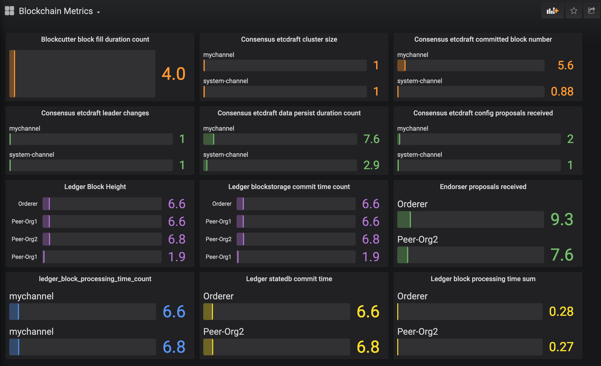
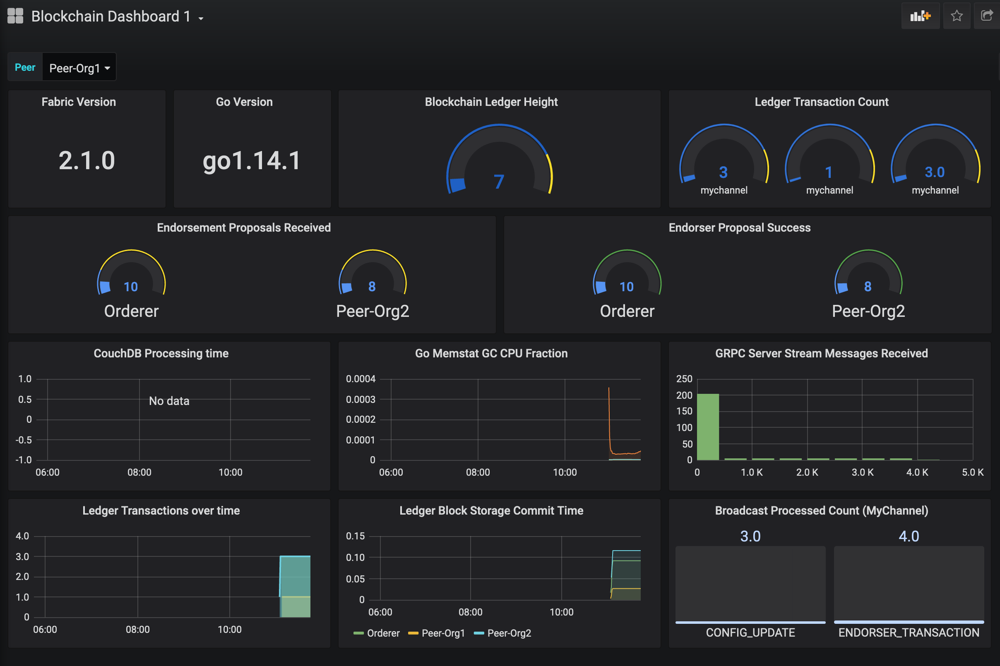

# Setting up Grafana in Kubernetes environment
This document explains how to setup Grafana in a Kubernetes 1.18 environment.
## Pre-requisites
Following are the pre-requisites,
* A working Kubernetes v1.18 setup
* A namespace named `monitoring` (Otherwise modify the config files accordingly)
* A Prometheus as the data source (The setup procedure is explained [here](../prometheus/README.md))
  
## Installation
Create a file named `grafana-deployment.yaml` with the following content,  
(A sample file is available [here](grafana-deployment.yaml))
```
apiVersion: apps/v1
kind: Deployment
metadata:
  name: grafana
  namespace: monitoring
spec:
  replicas: 1
  selector:
    matchLabels:
      app: grafana
  template:
    metadata:
      name: grafana
      labels:
        app: grafana
    spec:
      containers:
      - name: grafana
        image: grafana/grafana:latest
        ports:
        - name: grafana
          containerPort: 3000
```
Apply the configuration,
```
kubectl apply -f ./grafana-deployment.yaml
```
Create a file named `grafana-service.yaml` with the following content,  
(A sample file is available [here](grafana-service.yaml))
```
kind: Service
apiVersion: v1
metadata:
  name: grafana-service
  namespace: monitoring
spec:
  selector:
    app: grafana
  ports:
  - name: grafana
    nodePort: 30300
    protocol: TCP
    port: 3000
    targetPort: 3000
  type: NodePort
```
The grafana dashboard will be accessible over Node port 30300.

## Adding Hyperledger Dashboard in grafana
Configure the Prometheus created as per the documentation listed [here](../prometheus/README.md)

After configuring Prometheus, add promethues as a datasource in Grafana. (Follow the default procedure as explain in the Grafana documentation).

Import the following two dashboards for getting the Blockchain dashboards, 

Use [this](Blockchain%20Dashboard%201.json) JSON file for the first dashboard. If you import, you will get a dashboard like the below,



Use [this](Blockchain%20Dashboad%202.json) JSON file for the second dashboard. If you import, you will get a dashboard like the below,



You are free to customize these dashboards and add more parameters to monitor. 